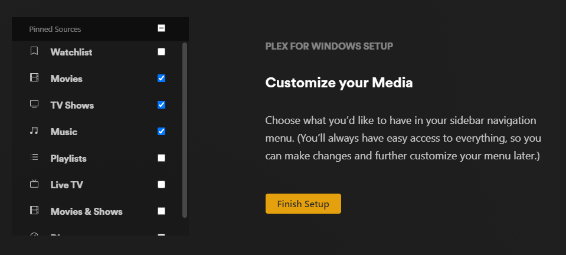
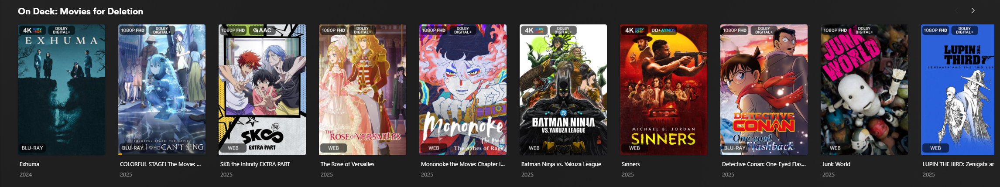
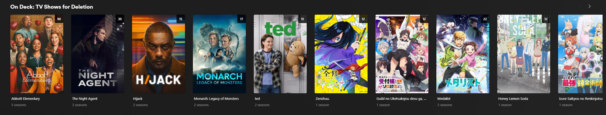
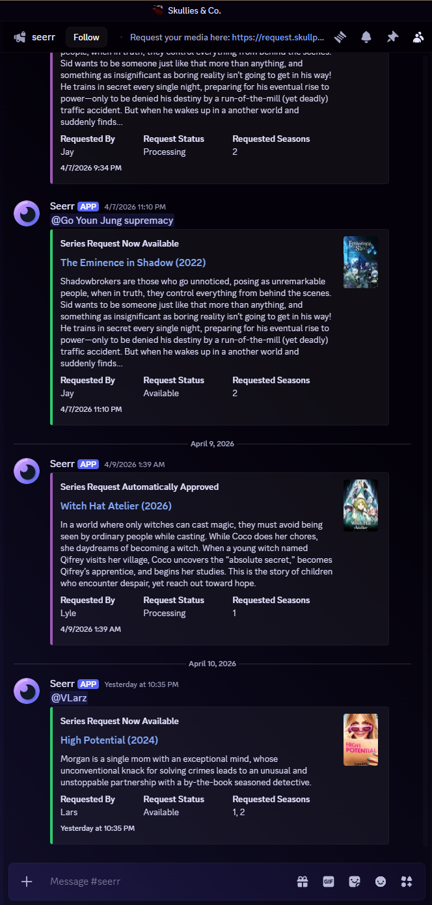
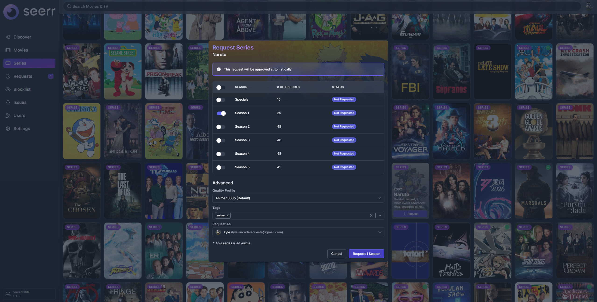

# ☠️ SKULLSERVER — Plex Home onboarding

**Welcome to my Plex Home** (SKULLSERVER). I’m the one running the box — you’re here for movies, TV, and music without paying a dozen subscriptions. Read this once, do the steps, don’t make me explain it twice. No geek cred required.

**Links:** I don’t put URLs in this doc — my **Plex** (web) and **Seerr** (requests) endpoints are on the public internet, and I’d rather not paste them where they’re easy to scrape or pass around. **I’ll send you the actual links directly** (DM, text, whatever we use). If you lose them, ask me again.

---

## 🏠 Part 1 — Getting set up on Plex

### 📧 1. Accept your invite

- I’ll hit you with an **email invite** to join my Plex Home.
- Open it and **create your Plex account** (or sign in if you already have one).
- Click through whatever Plex throws at you until you’re actually logged in.

### 📌 2. Pin your libraries (important)

In the Plex app or on the web, pick what shows on your home screen (**pinned** libraries).

| What to do          | Notes                                                                                                  |
| ------------------- | ------------------------------------------------------------------------------------------------------ |
| **Pin these three** | **Movies**, **TV Shows**, and **Music** — these are **required** so everything works the way I expect. |
| **Everything else** | Optional. Pin it if you’ll use it; don’t clutter your home with crap you ignore.                       |

If you’re lost: dig around **library settings**, **home screen**, or **pin** / **customize** in the sidebar or settings.

### 📲 3. Install the Plex app

Grab the Plex app for whatever you're watching on:

- [Plex (official)](https://www.plex.tv/media-server-downloads/?cat=plex+desktop&plat=windows#plex-app)
- [Plezy (alternative)](https://plezy.app/)

### 🎉 4. You're all set on Plex

Account works, those three libraries are pinned, app installed — cool, you can actually use the thing now.

### ⚡ 5. One habit that helps everyone — video quality

**Use the Plex app, not the browser, when you’re actually watching** — especially on a TV. The **web player** is fine for a quick peek; for real streaming it’s more likely to **transcode**, cap weird stuff, or just feel janky. Install **Plex** on the device and watch there.

**On the TV:** If you care about **proper 4K / HDR / direct play**, stop relying on whatever slow smart-TV built-in crap came with the panel. Buy a real box — I’m talking **Apple TV 4K**, **Google TV Streamer**, or a **Homatics 4K R Plus**. That’s the kind of hardware that actually gets you the full experience on a big screen.

**Phone / tablet / PC:** If it’s **not ancient**, you’re fine — modern devices decode what I serve without drama.

Use **Maximum** or **Original** quality in the player settings. I mean it.

- **Why:** Cranking quality down makes my server **transcode** (re-encode on the fly). That burns CPU for no good reason and defeats the whole point of what I’m hosting. You joined my Plex because you want the good stuff, not mush. **If you want cheap shit, go subscribe to Netflix or Disney+** — that’s literally what those are for.

---

## 🎯 Part 2 — Apps, auto sign-in & extra tips

Nice-to-haves. Skim it.

### 🔓 Auto sign-in (go straight to your account)

Sick of Plex asking **who’s watching** every time? Turn on **auto sign in** so it drops you straight on **your** profile.

1. **Settings** on **that** device (TV, phone, tablet, whatever).
2. Poke around **Account**, **General**, or **Advanced** — names vary by app.
3. Flip on **Automatically sign in**, **Auto sign in**, or **Keep me signed in** (whatever it’s called on your platform).

**Heads-up:** Great on **your** phone or a TV that’s basically yours. On the living-room TV the whole family uses, maybe **don’t** — so people can still switch profiles without fighting you for the remote.

---

## 📝 Part 3 — Requesting movies & shows (Seerr)

I run **Seerr** against **my** libraries. You want something new? Use the **Seerr** request app (browser). I’m not your personal shopper for stuff you’ll never watch.

### ⏳ Before you request

**Only request it if you’re actually going to watch it in the next ~30 days.**

- Stuff that sits there unwatched for 30 days **gets deleted** — I need the disk.
- Requests are for **real viewing**, not a “maybe someday” fantasy list. **Exception:** I keep **my own** favorites **forever** for archival purposes. I’m allowed; you’re not the one paying for the drives.

### 💬 Discord — request status updates

**Seerr** can ping you on Discord when a request moves (approved, available, whatever) — but only if you’re on **my** server and **I** can tie your Discord to your account.

**Send me your Discord username**. I’ll drag you into the server if you’re not there yet and wire up notifications.

### 🙋 How to request

1. Open **Seer** with the URL **I messaged you**.
2. **Sign in with Plex**.
3. Search the title. If it’s not already there, hit **request**. Done.

---
